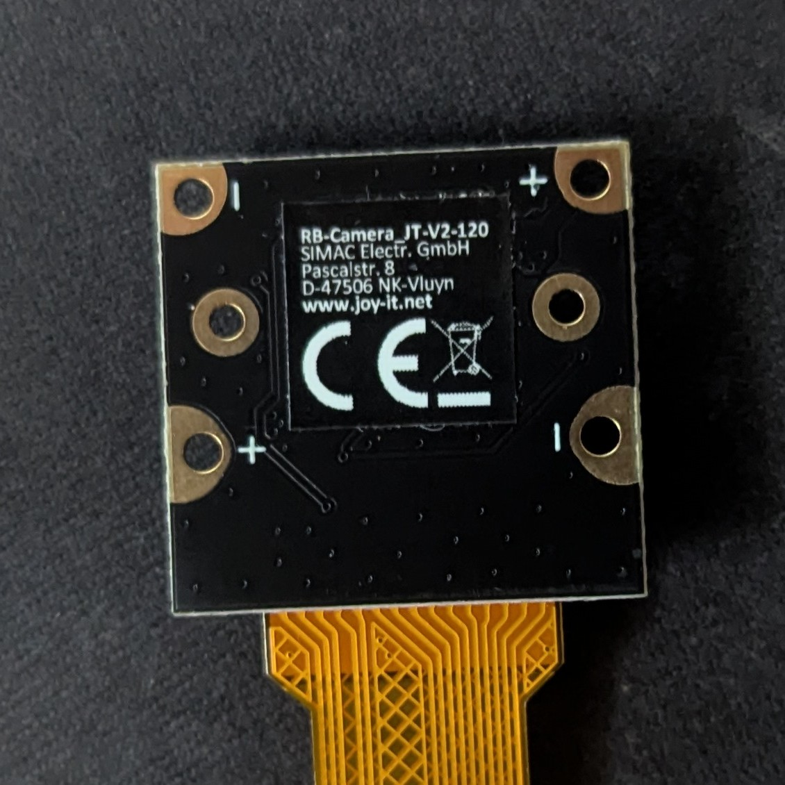

# Camera

<p float="left">   </p> <div align="center" style="font-size: 0.9em; margin-top: 0.5em;"> <em>Front and back views of the RB-Camera JT-v2-120 used in this setup</em> </div>

## Configuration:

To enable and configure the camera module on the Raspberry Pi zero, it is necessary to modify the system configuration file:

```bash
sudo nano /boot/config.txt
```
Add the following lines to explicitly enable the IMX219 camera sensor and allocate sufficient GPU memory for image processing (note: configuration may differ for other camera modules, such as the IMX477 or OV5647).

The setting camera_auto_detect=0 disables automatic camera detection, allowing manual specification of the camera model via dtoverlay=imx219. The start_x=1 directive enables the camera subsystem, and gpu_mem=128 allocates 128 MB of RAM to the GPU, which is necessary for processing images.

```bash
[all]
camera_auto_detect=0
dtoverlay=imx219
start_x=1
gpu_mem=128
```

After editing, reboot the system to apply the changes:

```bash
sudo reboot
```

### Capture Picture:
Once the camera has been correctly configured a, it is possible to test and capture images using command-line tools.

You can verify that the camera is operational by capturing a still image with one of the following commands:

```bash
libcamera-still -o photo_name.jpg
```
or
```bash
rpicam-still -o ./photo_name.jpg
```